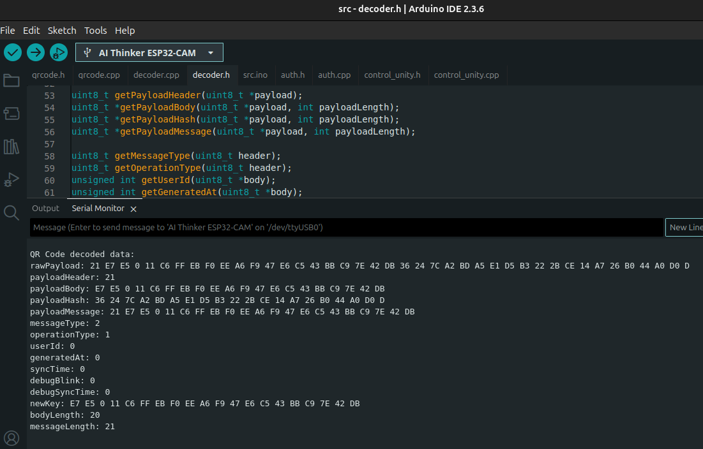

# causp-lock-esp32
Este repositório documenta o software programado no ESP32-CAM para o projeto CAUSP-LOCK. Trata-se de um sistema de controle de acesso à sala sensorial da Faculdade de Direito da USP, voltada a autistas e neurodivergentes. Na parte física, há uma tranca eletrônica, capaz de ler QR Codes de acesso, por meio de uma câmera OV2640 e um microcontrolador ESP32-CAM. Na parte de software, um website em React permite ao aluno neurodivergente se cadastrar e solicitar acesso à sala, gerando-lhe o QR Code de acesso.

<p align="center">
  
</p>

## Sistema físico
Fisicamente, o ESP32-CAM está conectado à câmera OV2640 e a um circuito de acionamento da fechadura elétrica, conforme o diagrama abaixo.

<p align="center">
  
</p>

Dada essa configuração, emprega-se os seguintes pinos GPIO com seus respectivos significados:

- ELETRIC_LOCK_PINK (GPIO 2): pino de acionamento da fechadura elétrica. Lógica positiva, abrindo a fechadura quando em HIGH e em IDLE quando em LOW.
- LED_BUILTIN (GPIO 4): acionamento do LED do ESP32-CAM.

Os pinos da câmera OV2640 estão encapsulados na implementação da biblioteca `ESP32QRCodeReader`, para o modelo `CAMERA_MODEL_AI_THINKER`. Portanto, não é necessária uma declaração explícita dos GPIOs da câmera no código.

## Controle da Câmera OV2640
A captura das imagens das câmeras é implementada pelo `qrcode.cpp` com `vTask`. A captura segue numa thread própria da função `onQrCodeTask`, que pode ou não ficar em IDLE a depender do booleano `readingQRCode`, para economizar energia e processamento. Por padrão, `readingQRCode = true` desde o início da aplicação. Mas, é possível interromper as leituras com os métodos `resumeQRCodeReading()` e `suspendQRCodeReading()`.

A biblioteca `ESP32QRCodeReader` encarrega-se de decodificar o payload do QR Code a partir da imagem capturada pela câmera. A cada captura, o `reader` da biblioteca, invocado no `onQrCodeTask` tenta detectar e decodificar o QR Code e a thread escreve o payload lido na variável `qrCodePayload` do `qrcode.cpp`. Essa variável do tipo struct, definida no header `qrcode.h`.

```cpp
typedef struct {
  uint8_t *rawPayload;
  int payloadLength;
  bool successfulRead;
} QRCodePayload;
```

Em que `rawPayload` é o array de bytes puros, que pode ter tamanho variado, `payloadLength` é o tamanho do payload lido e `successfulRead` é um booleano verdadeiro se a leitura foi bem sucedida e falso caso contrário.

Para efetuar a leitura, basta simplesmente acessar a variável `qrCodePayload`, que é acessível pela função `readQRCode()`.

```cpp
#include <qrcode.h>
/* code external to the module qrcode */
QRCodePayload qrcodeData;
qrcodeData = readQRCode();
```

Note que, enquanto a variável `readingQRCode` for `true`, a thread de leitura fará a captura das imagens, a detecção dos QR Codes e sua decodificação, independentemente de, naquele momento, a thread principal precisar do valor. Portanto, a leitura é um processo assíncrono e recomenda-se interrupção quando não for necessária a leitura de QR Codes, para economia de energia e processamento.

## Decodificação do payload do QR Code
Para extrair os dados originais em alto nível do QR Code, tais como `user_id` e `generated_at`, é preciso, depois de extrair o payload do QR Code como uma sequência de bytes, decodificar esses bytes em dados e armazená-los em variáveis do C++. O módulo `decoder.cpp` é o responsável por tal tarefa. Em seu header `decoder.h`, define-se um struct `DecodedQRCodeData` que representa os dados de alto nível decodificados.

```cpp
typedef struct {
  uint8_t payloadHeader;
  uint8_t *payloadBody;
  uint8_t *payloadHash;
  uint8_t *payloadMessage;
  uint8_t messageType;
  uint8_t operationType;
  unsigned int userId;
  unsigned int generatedAt;
  unsigned int syncTime;
  unsigned int debugBlink;
  unsigned int debugSyncTime;
  uint8_t *newKey;
  bool successfulDecoding;
  int bodyLength;
  int messageLength;
  bool needToAuthenticate;
} DecodedQRCodeData;
```

Além disso, ele possui uma função `getQRCodeData()`, que recebe como parâmetros o `payload`, como um array de bytes, e seu tamanho `payloadLength` como um inteiro, e retorna um struct `DecodedQRCodeData`.
 
```cpp
DecodedQRCodeData myData;
myData = getQRCodeData(payload, payloadLength);
```

Para visualizar os dados, pode-se utilizar a função `printDecodedQRCodeData()`:

```cpp
printDecodedQRCodeData(myData);
```

Por exemplo, para um QR Code de teste obteve-se como saída do `printDecodedQRCodeData()` o conteúdo contido na imagem a seguir.

<p align="center">
  
</p>